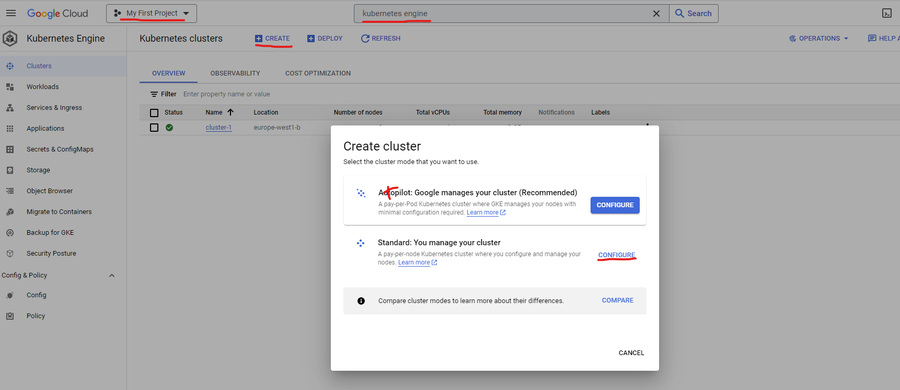
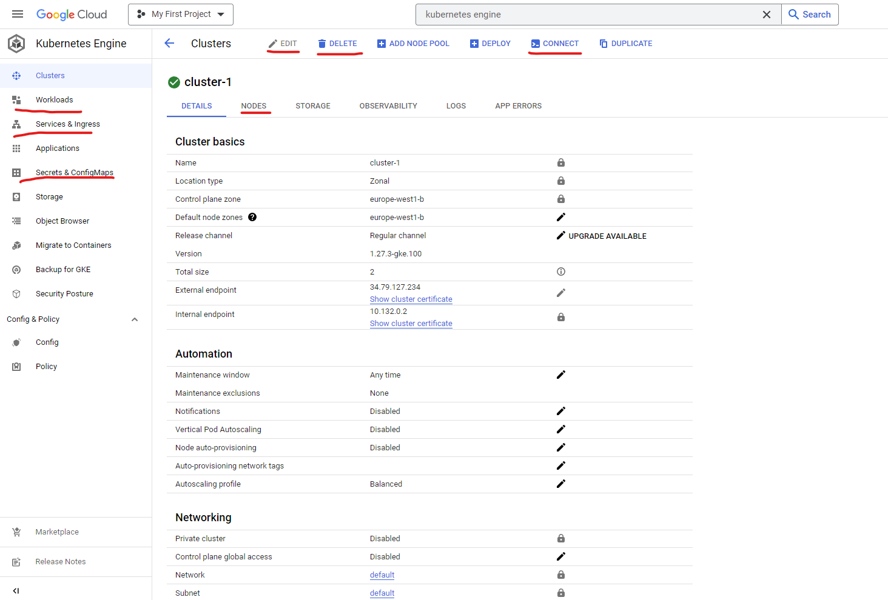

### Cluster Configuration

1. Create a Google Cloud account, and insert your credit cards information for a free trial of
3 months with 300$.
2. Next, go to the Cloud Resource Manager and click the "Create Project" button. Assign a name to your project, select a billing account, and specify a location.
3. To create the Kubernetes cluster, navigate to "Kubernetes Engine" → "Clusters" in your Google Cloud Console. Click on "Create Cluster". 
Specify the name, location, and Kubernetes version. You can also configure the default node pool for your cluster. After you've made your selections, click "CREATE". \
<b>Make sure you do not use the 'autopilot', method. It won't allow you to choose number of nodes. </b>

I recommend using at least 2 nodes, and when you finish working for the day you can change the number to 0 and save money.\
Don't worry, it won't delete anything.
4. To connect via the Google Cloud Shell, click the "Connect" button next to your cluster, then click "Run in Cloud Shell". Google Cloud will initialize and establish a connection to the cloud shell.

5. 