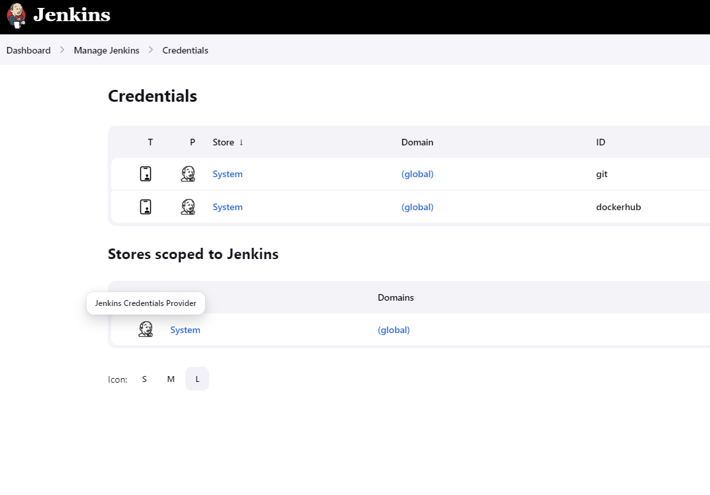
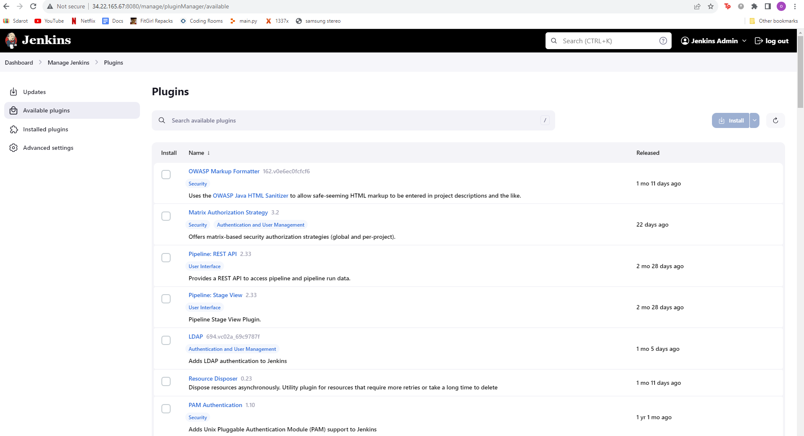

## install Jenkins instance on Kubernetes cluster
(based on this page: [Install Jenkins using helm](https://argo-cd.readthedocs.io/en/stable/getting_started/](https://sweetcode.io/how-to-setup-jenkins-ci-cd-pipeline-on-kubernetes-cluster-with-helm/)))

### Requirements
- Installed kubectl command-line tool.
- Connected to a Kubernetes cluster - Have a kubeconfig file (default location is ~/.kube/config).
- Install helm.
 
### Install Jenkins
```
sudo apt install helm
```
Add jenkins to your helm repo:
```
helm repo add jenkins https://charts.jenkins.io
```

Update your repo:
```
helm repo update
```

To install Jenkins with custom plugins, create a values.yaml with the following content:
```
jenkins:
  Master:
    installPlugins:
      - kubernetes:3937.vd7b_82db_e347b_
      - workflow-aggregator:596.v8c21c963d92d
      - git:5.2.0
      - configuration-as-code:1647.ve39ca_b_829b_42
      - gitlab-plugin:1.7.14
      - blueocean:1.27.4
      - workflow-multibranch:756.v891d88f2cd46
      - login-theme:46.v36f624efb_23d
      - prometheus:2.2.3
      - github-oauth:588.vf696a_350572a_

```
Install the official jenkins package with your values.yaml:
```
helm install jenkins jenkins/jenkins -f values.yaml
```

Install the official jenkins package:
```
helm install jenkins jenkins/jenkins
```

Get the password:
```
kubectl get secret --namespace jenkins jenkins -o jsonpath="{.data.jenkins-admin-password}" | base64 --decode
```
Get the LoadBalancer ip:
```
kubectl get svc --namespace=...('default' is the default namespace for the installation) 
```

Go to the website where the IP is the external-service-IP of the 'Jenkins' service with port 8080

Login to jenkins using the username: 'admin' and the above password.

Install the suggested plugins and follow the given instructions.
### Create credentials
Click on "Manage Jenkins" on the left side. \
Click on the "Credentials" section. \
Click on "(global)" under Domain. \

click +add credentials in blue in the top right corner and create username
with password kind both for your git repo and dockerhub. \
The description is then crucial for the definition of the pipeline.

### Install plugins



Click on "Manage Jenkins" on the left side. \
Click on the "Plugins" section. \
Go to "Available plugins". \
Search for: 'Blue Ocean', 'Docker plugin', 'Docker', 'Kubernetes plugin', 'Pipeline', 'Email plugin' \
note that the multibranch workflow plugin is not supported anymore, and we now need to use the 
'Multibranch Pipeline' job type.

### Create pipeline job
In the Dashboard, click "+ New Item" \
Select 'Multibranch Pipeline', give a name, and click 'ok'. \
Give it a display name and description as you like. \
Under 'Branch Sources' select git. \
Enter this project url [repo](https://github.com/Guyashkenazi6/profileapp), and put the credentials we configured earlier.
The pipeline will search for a file called "Jenkinsfile" that exists in the main branch in this repo

