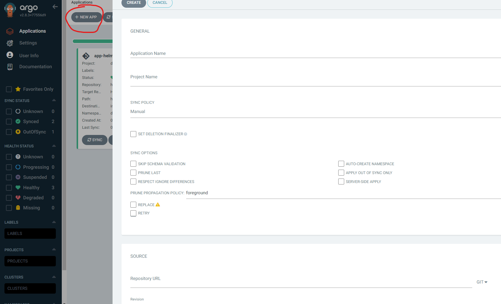

### App Installation


In your cluster run:

```
kubectl create ns app
```
This command will create a namespace called "app" in the cluster that we will use later on in this deployment

After loging in to the argo UI, click the "+ NEW APP" on the top left
and fill in the following fields:



<b>application name</b>: your-app-name \
<b>project name</b>: default \
<b>source</b>: this git repo [http](https://github.com/Milk18/final_project.git) \
<b>path</b>: helmapp \
<b>cluster URL</b>: It will autofill the cluster that argo is running on \
<b>Namespace</b>: app

After filling all the required fields, you can click "sync" on the created window. \
This will run both the deployment and service yamls files that belongs to the app
and make a pod with a LoadBalancer service that is open to the world on port '9000'


To see your pods and svc, you can click on the main window and get a diagram
that fully shows the relations of the different resources. 


In order to get the external ip, simply click the svc resource, and you can get it
under the 'HOSTNAMES' category:


Now you can simply access the app with the external ip and port 9000