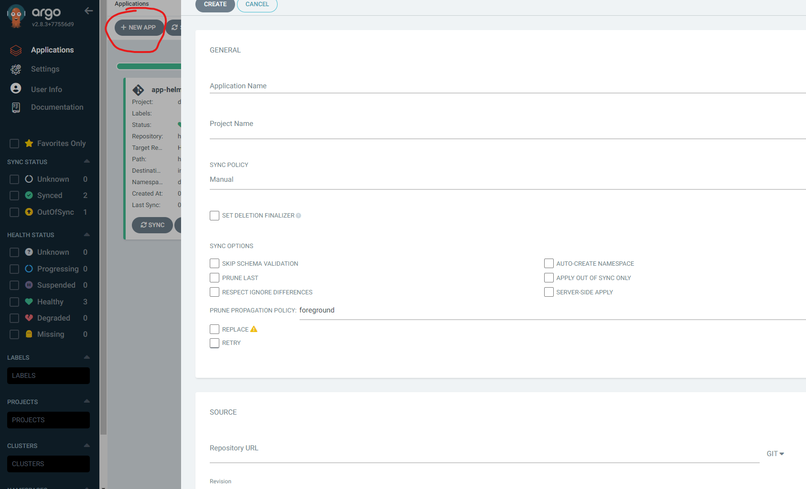
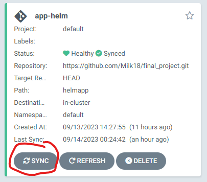
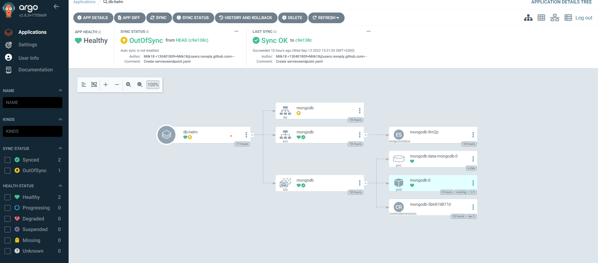

### MongoDB Installation


In your cluster run:

```
kubectl create ns db
```
This command will create a namespace called "db" in the cluster that we will use later on in this deployment

After loging in to the argo UI, click the "+ NEW APP" on the top left
and fill in the following fields:



<b>application name</b>: your-db-name \
<b>project name</b>: default \
<b>source</b>: this git repo [http](https://github.com/Milk18/final_project.git) \
<b>path</b>: helmdb \
<b>cluster URL</b>: It will autofill the cluster that argo is running on \
<b>Namespace</b>: db

After filling all the required fields, you can click "sync" on the created window. \
This will run both the deployment and service yamls files in that belongs to the db
and make a pod with a LoadBalancer service that is open to the world on port '27017'



To see your pods, pvc's, and svc, you can click on the main window and get a diagram
that fully shows the relations of the different resources. 

